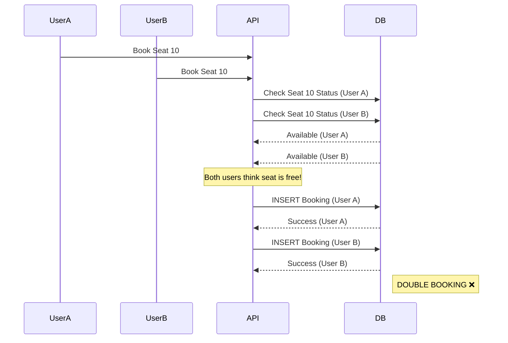
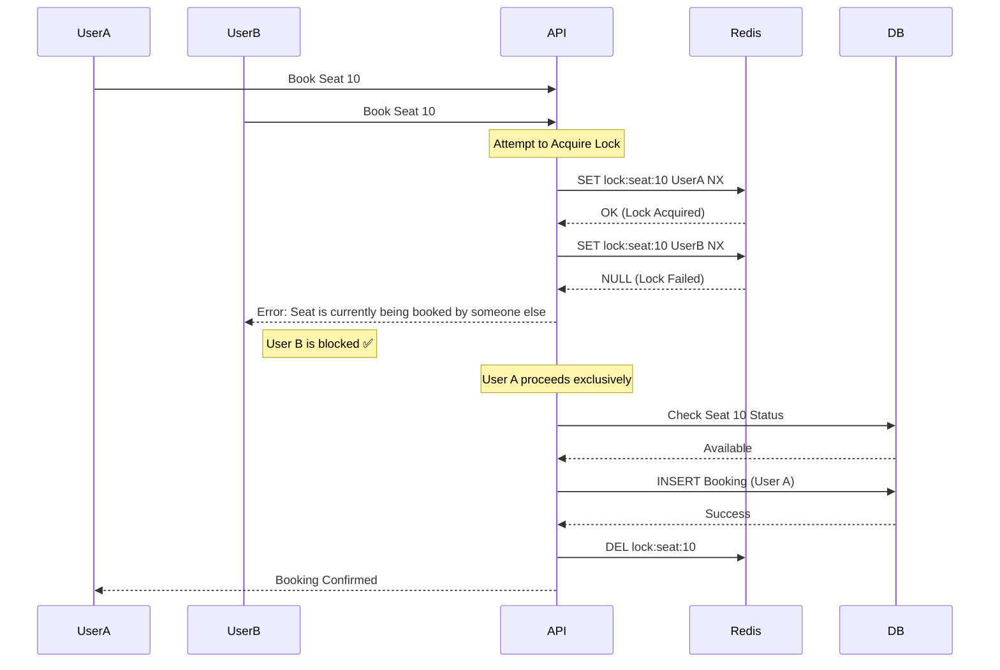

# Concurrency Control & Locking

This project simulates two Booking Architectures to demonstrate the "Double Booking" problem and its solution.

## 1. The Naive Approach (Race Condition)

In the naive implementation, we check for seat availability and then book it in two separate database steps. This creates a "gap" where multiple concurrent requests can all see the seat as "Available" before anyone has booked it.

## 2. The Secure Approach (Redis Distributed Lock)

To fix this, we implement a **Pessimistic Locking** strategy using Redis. Before even checking the database, a user must acquire a unique lock on the specific seat ID.

We use the Redis command: `SET lock:seat:{id} {userId} NX EX 600`
- **NX**: Only set if **N**ot e**X**ists (Atomic lock acquisition)
- **EX**: **Ex**pire in 600 seconds (TTL to prevent deadlocks)

## Comparisons

| Feature | Naive Approach | Distributed Locking (Redis) |
| :--- | :--- | :--- |
| **Consistency** | Low (Classic Double Booking) | High (Strict Serialization) |
| **Performance** | High (No locking overhead) | Medium (Network call to Redis) |
| **User Experience** | Bad (Booking failures after payment) | Good (Fast failure if seat is taken) |
| **Scaling** | Fails at scale | Scales well with Redis Cluster |
